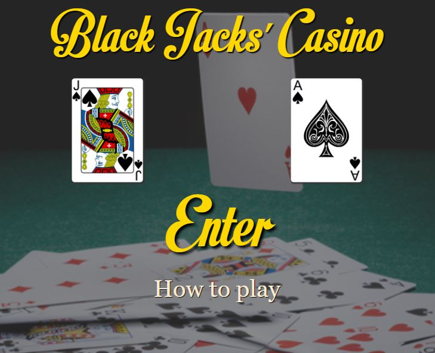
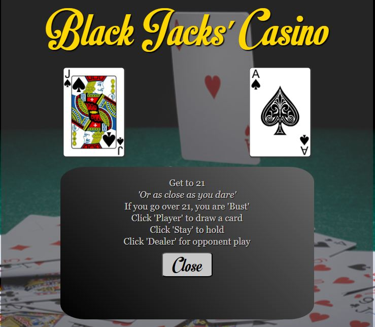
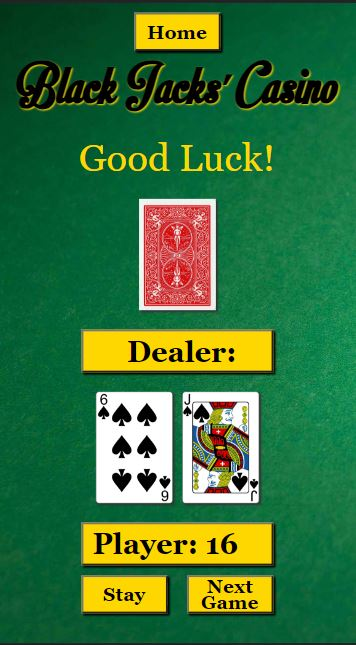
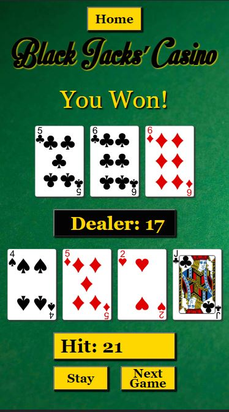
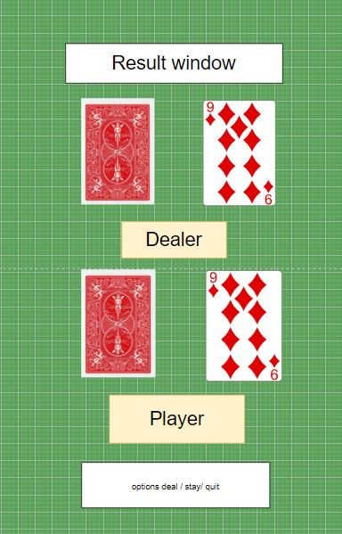
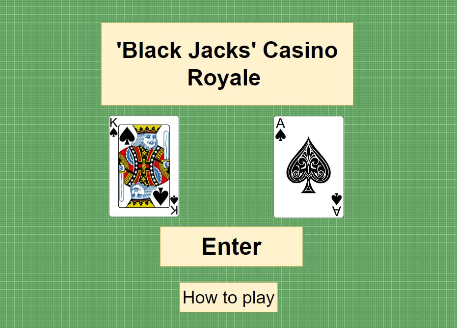
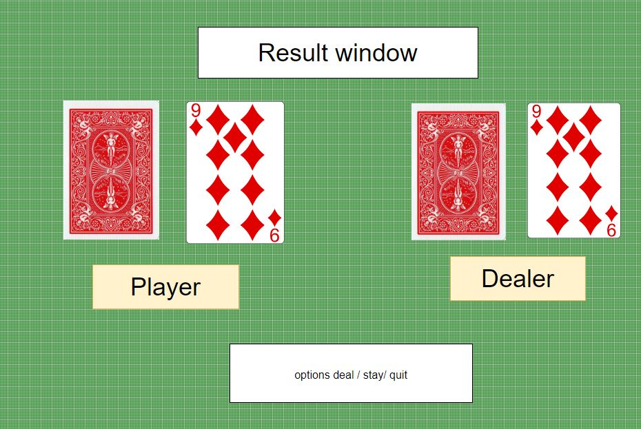
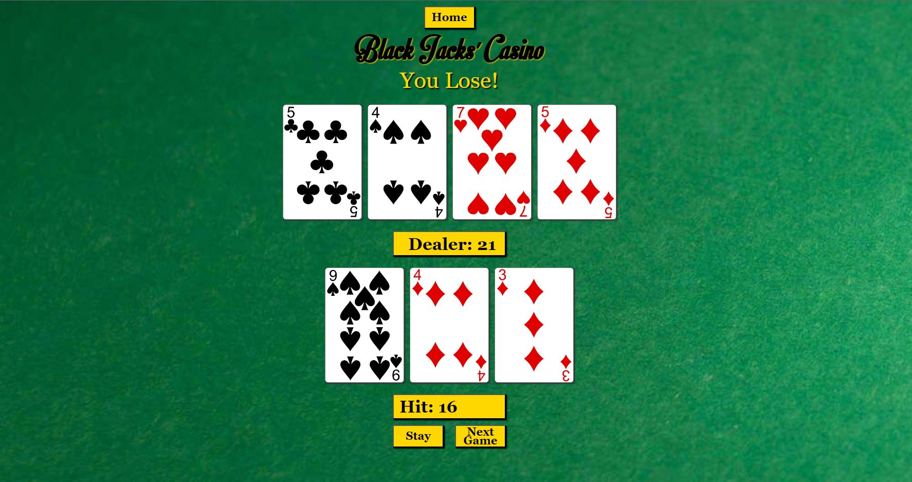

# 'Black' Jack's Casino
A card game pitching player vs computer.

The game is intended for entertainment purposes only and does not involve any form of gambling. The target audience are adults looking for an entertaining game which can be enjoyed in moments of leisure, such as 'tea-breaks', 'lunch-breaks', etc

['Black' Jacks' Casino-Github repository]( https://github.com/Braxxian/5P_P2.git)

['Black' Jacks' Casino-live site](https://braxxian.github.io/5P_P2/)

### Table of contents (to be filled)

## Planning & Development
### User stories

* As a user I want an entertaining game that can be enjoyed in short leisure breaks
* As a user I want to be able to play the game across all my different devices
* As a user I want to be able to easily learn how to play
* As a user I want to enjoy the fun of cards, without gambling

### Site Owner goals

* As the site owner I want to provide a fun game that does not require a large amount of the user's time
* As the site owner I want to provide the fun of card games without feeding into a gambling narrative
* As the site owner I want to be able to extend the sites features in future development

### Features
#### The Hero Page
* The site has been designed to perform and size well on all commonly used devices
* The hero page is designed to provide clear and simple navigation to the user, with 2 options: 'Enter' or 'Learn how to play'
* Clicking the enter button, confirms the user action by changing in color and size and the 'how to play' option opens a modal 'pop-up' with the game instructions:

#### The game page

* The gaming area is designed to fit comfortably on all common device sizes. It presents the user with a graphical simulation of a game of cards in a casino.
* The bankers card is hidden until the 'dealer' plays, giving an element of suspense to the result
* The user can interact with the game by requesting another card or choose to stay with the current hand. The user may then initiate the dealer button to reveal the bankers' cards.
* The result is displayed in the 'Good Luck!' placeholder area.
* The user may then choose to move to the next game or return to the home page

 

iPhone SE 375px Starting hand and a lucky win!

### Wireframes

Due to the simple layout and cards resizing. It proved unnecessary
to use the original desktop layout frames although they are pictured as well for reference. 

 

Here is the live deployment for desktops for comparison. It proved a better design, due to card space when a player has a larger hand.

### Color Scheme

The green color of the card table and the nature of the game made
black and gold a simple and obvious choice. They work well together
as contrasts, provide easily reversed shadows and have an evocative
quality, in keeping with the casino theme.

### Fonts

The 'Black Jacks' casino name and the enter button used 'MotionPicture'. A font by 'Mans Greback', sourced from https://www.1001fonts.com/. not licenced for commerical use and used only as a personal project

Georgia, 'Times New Roman', Times, serif; 

### Images

The Hero image and the game area image were both sourced from https://www.freepik.com/

The card images were taken from [ https://github.com/ImKennyYip/black-jack](#credits)

## Credits