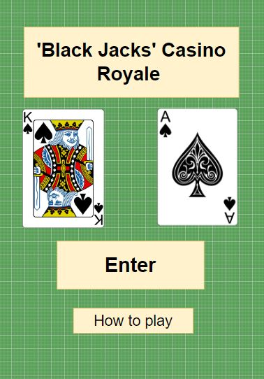

# 'Black' Jack's Casino
A card game pitching player vs computer.

The game is intended for entertainment purposes only and does not involve any form of gambling. The target audience are adults looking for an entertaining game which can be enjoyed in moments of leisure, such as 'tea-breaks', 'lunch-breaks', etc

['Black' Jacks' Casino-Github repository]( https://github.com/Braxxian/5P_P2.git)

['Black' Jacks' Casino-live site](https://braxxian.github.io/5P_P2/)

### Table of contents (to be filled)

## Planning & Development
### User stories

* As a user I want an entertaining game that can be enjoyed in short leisure breaks
* As a user I want to be able to play the game across all my different devices
* As a user I want to be able to easily learn how to play
* As a user I want to enjoy the fun of cards, without gambling

### Site Owner goals

* As the site owner I want to provide a fun game that does not require a large amount of the user's time
* As the site owner I want to provide the fun of card games without feeding into a gambling narrative
* As the site owner I want to be able to extend the sites features in future development

### Features
#### The Hero Page
* The site has been designed to perform and size well on all commonly used devices
* The hero page is designed to provide clear and simple navigation to the user, with 2 options: 'Enter' or 'Learn how to play'
* Clicking the enter button, confirms the user action by changing in color and size and the 'how to play' option opens a modal 'pop-up' with the game instructions:

#### The game page

* The gaming area is designed to fit comfortably on all common device sizes. It presents the user with a graphical simulation of a game of cards in a casino.
* The bankers card is hidden until the 'dealer' plays, giving an element of suspense to the result
* The user can interact with the game by requesting another card or choose to stay with the current hand. The user may then initiate the dealer button to reveal the bankers' cards.
* The result is displayed in the 'Good Luck!' placeholder area.
* The user may then choose to move to the next game or return to the home page

 

iPhone SE 375px Starting hand and a lucky win!

### Wireframes

Due to the simple layout and cards resizing. It proved unnecessary
to use the original desktop layout frames although they are pictured as well for reference. 

 

Here is the live deployment for desktops for comparison. It proved a better design, due to card space when a player has a larger hand.

### Color Scheme

The green color of the card table and the nature of the game made
black and gold a simple and obvious choice. They work well together
as contrasts, provide easily reversed shadows and have an evocative
quality, in keeping with the casino theme.

### Fonts

The 'Black Jacks' casino name and the enter button used 'MotionPicture'. A font by 'Mans Greback', sourced from https://www.1001fonts.com/. not licenced for commerical use and used only as a personal project

Georgia, 'Times New Roman', Times, serif; 

### Images

The Hero image and the game area image were both sourced from https://www.freepik.com/

The card images were taken from [ https://github.com/ImKennyYip/black-jack](#credits)

### Future Development

Looking forward, I would like to implement a persistant score
tracking method, displaying the win - lose count on a scoreboard.

# Testing

### Manual Testing

#### Illegal moves or player error handling

| Action   |      Expected Result      |  Pass or Fail |
|:----------|:-------------:|:------:|
| Player tries to stay while under 15 |  Action fails & player is reminded of the rules | Pass |
| Player tries to initiate dealers turn before finishing their own |    Action fails and player is prompted to finish their turn first   |   Pass |
| Player tries to draw a card after choosing to stay | Action fails and player is reminded they chose to stay |    Pass |

## HTML Validation

[W3C Markup Validation Service](https://validator.w3.org/) was used for HTML error checking:

### CSS Validation
[Jigsaw](https://jigsaw.w3.org/css-validator/) was used for CSS error checking

### JavaScript Validation
[JSHint](https://jshint.com/) was used for error checking of code

The report notes 3 unused variables. This is a false positive. The functions are called in the HTML using "onclick()" and not from within the code itself, which is why they are flagged as unused

### Lighthouse

The lighthouse tool in chrome developer tools was used to check for:
 * performance
 * accessibility
 * best practices
 * seo

 lighthouse desktop:
 

 

 lighthouse mobile:

 

 

 ## Bugs

 On initial testing of the JavaScript with JSHint, the for loops were flagged as vulnerable to inheritance from other objects. This was resolved by adding an 'If' conditional of .hasOwnProperty.
 Subsequent testing with JSHint showed the error warning removed.

 for loop issue before:
 

 for loop issue resolved:
 

 ## Technologies Used

 All code was written using: [Visual Studio Code](https://code.visualstudio.com/)

Version Control: [Git](https://git-scm.com/)

Repository and Deployment: [Github](https://github.com/)

Image Editing: [Faststone](https://www.faststone.org/)

Image Conversion: [FormatFactory](http://www.oldversion.com/windows/format-factory/)

## Deployment

To deploy the github repository to gitpages:

1. Open your repository in Github and click on settings (top-right)

1. Select Pages from the left-hand bar 

1. Select Deploy from branch, main, /root and click save

1. Wait a moment, when the site is deployed, you can see the URL

## Credits

A huge thanks to [Kenny Yip](https://www.kennyyip.com/) for freely sharing the card images which were used in this project.

Also for his JavaScript walk through tutorial upon which this project was based https://www.youtube.com/watch?v=bMYCWccL-3U

My code institute mentor, Oluwafemi Medale, for his support and suggestions.

[Freepik](https://www.freepik.com/) for providing the index and game page background images

